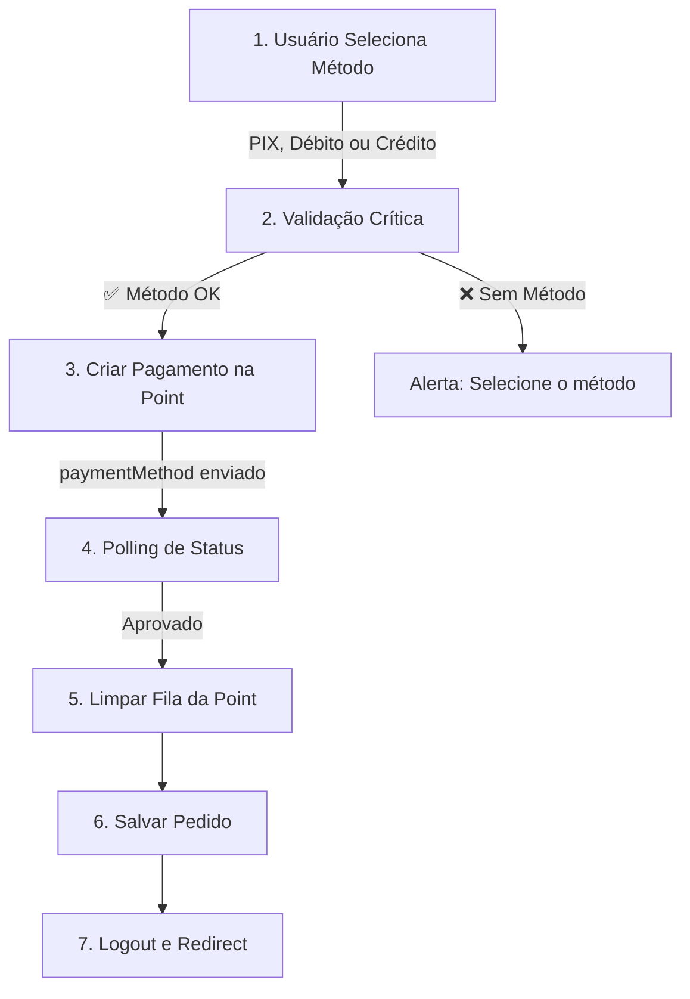

# 🤖 Integração Point Smart 2 - Modo PDV

## 📋 Resumo das Mudanças

Este documento descreve as melhorias implementadas no frontend para garantir a integração perfeita com a **Point Smart 2** do Mercado Pago em **Modo PDV** (Ponto de Venda).

---

## ✅ Funcionalidades Implementadas

### 1. **Configuração Automática da Point na Inicialização** ✨

**Arquivo:** `App.tsx`

A Point Smart 2 é automaticamente configurada em **modo PDV** quando o sistema inicia. Isso garante:

- 🔒 **Menu da maquininha bloqueado** - usuário não consegue acessar configurações
- 🔗 **Vinculação permanente** ao sistema - maquininha fica em modo "integração"
- 📱 **Apenas comandos via API** são aceitos
- ✅ **Verificação automática** de status da conexão

**Como funciona:**
```typescript
// Executado automaticamente ao iniciar o App
useEffect(() => {
  const initializePoint = async () => {
    // 1. Configura modo PDV
    const configResult = await configurePoint();
    
    // 2. Verifica status (opcional)
    if (configResult.success) {
      const statusResult = await checkPointStatus();
      console.log('✅ Sistema pronto para pagamentos');
    }
  };
  
  initializePoint();
}, []);
```

---

### 2. **Validação Crítica de Método de Pagamento** 🚨

**Arquivo:** `PaymentPage.tsx`

**IMPORTANTE:** O sistema agora **NUNCA** envia um pagamento sem especificar o método (PIX, Débito ou Crédito).

**Proteções adicionadas:**
- ❌ Bloqueia pagamento se `paymentMethod` for `null`
- 🚨 Exibe alerta ao usuário pedindo para selecionar o método
- 📝 Log detalhado de erro no console para debug

**Código de validação:**
```typescript
const handlePayment = async () => {
  // ⚠️ VALIDAÇÃO CRÍTICA
  if (!paymentMethod) {
    console.error('❌ Método de pagamento não especificado!');
    setErrorMessage('Por favor, selecione a forma de pagamento');
    setStatus('error');
    return; // BLOQUEIA o pagamento
  }
  
  // Prossegue apenas se método foi selecionado
  // ...
};
```

**Por que isso é importante:**
- Point Smart 2 **PRECISA** saber qual método aceitar
- Sem especificar, a maquininha mostra **TODAS** as opções (PIX, Débito, Crédito)
- Com método especificado, a Point **força apenas aquele método**

---

### 3. **Serviço Centralizado para Point** 🛠️

**Arquivo:** `services/pointService.ts` (NOVO)

Criado serviço dedicado com 3 funções principais:

#### `configurePoint()`
Configura a Point em modo PDV (bloqueia menu).

```typescript
const result = await configurePoint();
// { success: true } ou { success: false, error: "..." }
```

#### `checkPointStatus()`
Verifica se a Point está conectada e retorna informações.

```typescript
const status = await checkPointStatus();
// {
//   connected: true,
//   model: "Point Smart 2",
//   operating_mode: "PDV",
//   status: "ONLINE"
// }
```

#### `clearPaymentQueue()`
Limpa TODA a fila de pagamentos pendentes (evita cobranças duplicadas).

```typescript
const result = await clearPaymentQueue();
// { success: true, cleared: 2 }
```

---

## 🔄 Fluxo de Pagamento Atualizado

### Sequência Completa (6 Etapas)



### Código Resumido
```typescript
// 1. Validação
if (!paymentMethod) {
  alert('Selecione PIX, Débito ou Crédito');
  return;
}

// 2. Criar pagamento (COM método especificado)
const payment = await fetch('/api/payment/create', {
  body: JSON.stringify({
    amount: total,
    paymentMethod: paymentMethod, // ← OBRIGATÓRIO!
  })
});

// 3. Aguardar aprovação (polling)
while (!approved) {
  const status = await checkStatus(payment.id);
  if (status === 'approved') approved = true;
  await sleep(3000);
}

// 4. Limpar fila (evita cobranças duplicadas)
await clearPaymentQueue();

// 5. Salvar e finalizar
await saveOrder();
logout();
navigate('/');
```

---

## 🎯 Benefícios Conquistados

### Para o Usuário Final
- ✅ **Processo mais rápido** - maquininha mostra apenas o método selecionado
- ✅ **Menos confusão** - não aparecem opções desnecessárias
- ✅ **Segurança** - não pode cobrar duas vezes o mesmo pagamento

### Para o Operador/Administrador
- ✅ **Maquininha sempre vinculada** - não precisa reconfigurar
- ✅ **Menu bloqueado** - usuário não muda configurações
- ✅ **Logs detalhados** - fácil debug se algo der errado

### Para o Sistema
- ✅ **Integração robusta** - validações múltiplas
- ✅ **Código limpo** - serviço centralizado
- ✅ **Manutenível** - fácil adicionar novas funcionalidades

---

## 🧪 Como Testar

### 1. Verificar Configuração Inicial
```bash
# Abra o console do navegador ao iniciar o sistema
# Deve aparecer:
✅ Point Smart 2 configurada em modo PDV
🔒 Menu bloqueado - apenas comandos via API
✅ Sistema pronto para receber pagamentos
📱 Dispositivo: Point Smart 2
⚙️ Modo: PDV
```

### 2. Testar Validação de Método
1. Vá para a tela de pagamento
2. **NÃO** selecione nenhum método
3. Clique em "Processar Pagamento"
4. **Esperado:** Alerta aparece pedindo para selecionar método

### 3. Testar Pagamento Completo
1. Adicione produtos ao carrinho
2. Vá para pagamento
3. **Selecione um método** (PIX, Débito ou Crédito)
4. Clique em "Processar Pagamento"
5. **Point deve mostrar APENAS** o método selecionado
6. Complete o pagamento na maquininha
7. **Sistema deve:**
   - Aprovar automaticamente
   - Limpar fila
   - Salvar pedido
   - Fazer logout
   - Voltar ao início

---

## 📱 Sobre o Modo PDV

### O que é?
**PDV (Ponto De Venda)** é um modo especial da Point Smart 2 onde:

- 🔐 Maquininha fica "travada" no modo integração
- 🚫 Usuário não consegue acessar menu/configurações
- 📡 Aceita apenas comandos via API REST
- 🔄 Mantém vinculação mesmo após reinicialização

### Como Desbloquear (se necessário)
**Opção 1:** Painel do Mercado Pago
- Entre em https://mercadopago.com.br
- Vá em "Dispositivos"
- Clique na Point e altere modo

**Opção 2:** Via API (requer credenciais)
```bash
curl -X PATCH \
  https://api.mercadopago.com/point/integration-api/devices/DEVICE_ID \
  -H "Authorization: Bearer ACCESS_TOKEN" \
  -d '{"operating_mode": "STANDALONE"}'
```

---

## 🚨 Avisos Importantes

### ⚠️ NUNCA envie pagamento sem `paymentMethod`
```typescript
// ❌ ERRADO - Point mostra TODAS as opções
await fetch('/api/payment/create', {
  body: JSON.stringify({ amount: 25.00 })
});

// ✅ CORRETO - Point força apenas o método escolhido
await fetch('/api/payment/create', {
  body: JSON.stringify({ 
    amount: 25.00,
    paymentMethod: 'pix' // ou 'debit' ou 'credit'
  })
});
```

### ⚠️ Point em modo PDV NÃO pode ser usada manualmente
Se precisar fazer um pagamento manual (sem sistema), você DEVE:
1. Desbloquear a Point (via painel ou API)
2. Fazer o pagamento manual
3. Reconfigurar em modo PDV novamente

---

## 📞 Suporte

### Logs para Debug
Todos os logs importantes têm emojis para fácil identificação:

- ✅ Sucesso
- ⚠️ Aviso (não bloqueia funcionamento)
- ❌ Erro crítico
- 🔍 Informação de debug
- 🚀 Inicialização
- 💳 Pagamento

### Se Point não configurar:
1. Verifique se `MP_ACCESS_TOKEN` e `MP_DEVICE_ID` estão corretos no backend
2. Confirme se a Point está ligada e conectada
3. Teste acesso ao endpoint: `GET /api/point/status`

---

## 📦 Arquivos Modificados

```
FrontendMachineToten/
├── App.tsx                        ← Adicionado configuração automática
├── pages/
│   └── PaymentPage.tsx            ← Adicionado validação crítica
└── services/
    └── pointService.ts            ← NOVO - Serviço centralizado
```

---

## 🎓 Referências

- [Documentação Mercado Pago - Point Smart](https://www.mercadopago.com.br/developers/pt/docs/mp-point)
- [API Reference - Integration API](https://www.mercadopago.com.br/developers/pt/reference/integrations_api/_point_integration-api_devices/get)
- [Modo PDV - Operating Modes](https://www.mercadopago.com.br/developers/pt/docs/mp-point/integration-configuration/operating-mode)

---

**Implementado em:** Novembro 2025  
**Status:** ✅ Pronto para Produção  
**Testado:** Point Smart 2 (firmware atualizado)
