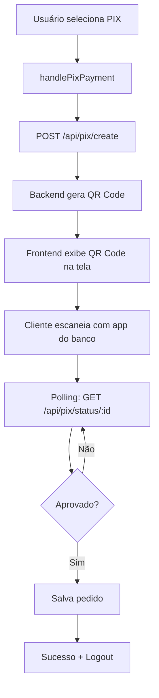
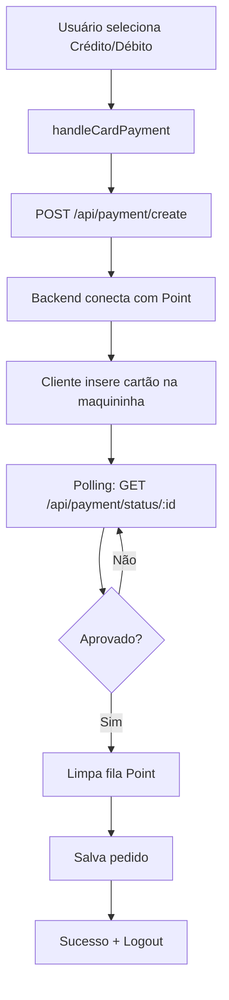

# 💠 Sistema de Pagamento PIX com QR Code

## 📋 Resumo da Implementação

Sistema de pagamento **dual** implementado no frontend:
- **PIX**: Gera QR Code na tela → Cliente escaneia → Confirmação automática
- **Cartões**: Vai para maquininha Point Pro 2 → Cliente insere cartão → Confirmação automática

---

## 🔄 Fluxo de Pagamento por Tipo

### 💠 Fluxo PIX (QR Code na Tela)



**Detalhes Técnicos:**
- **Endpoint criação**: `POST /api/pix/create`
- **Endpoint status**: `GET /api/pix/status/:id`
- **Retorno**: `{ id, qrCodeBase64, status }`
- **QR Code**: Base64 PNG exibido como ``
- **Polling**: A cada 3 segundos por até 3 minutos
- **Limpeza**: Não precisa limpar fila (não usa maquininha)

---

### 💳 Fluxo Cartões (Maquininha Point Pro 2)



**Detalhes Técnicos:**
- **Endpoint criação**: `POST /api/payment/create`
- **Endpoint status**: `GET /api/payment/status/:id`
- **Retorno**: `{ id, status }`
- **Polling**: A cada 3 segundos por até 3 minutos
- **Limpeza**: Obrigatório chamar `clearPaymentQueue()` após aprovação

---

## 📁 Estrutura do Código

### Estados do Componente

```typescript
// Estados comuns
const [paymentMethod, setPaymentMethod] = useState<"credit" | "debit" | "pix" | null>(null);
const [status, setStatus] = useState<"idle" | "processing" | "success" | "error">("idle");

// Estados específicos para PIX
const [qrCodeBase64, setQrCodeBase64] = useState<string | null>(null);
const [pixPaymentId, setPixPaymentId] = useState<string | null>(null);
```

---

### Funções Principais

#### 1. `handlePayment()` - Roteador Principal
```typescript
const handlePayment = async () => {
  // Validação
  if (!paymentMethod) {
    setErrorMessage('Selecione forma de pagamento');
    return;
  }

  // Direciona para função específica
  if (paymentMethod === "pix") {
    await handlePixPayment(); // 💠 QR Code
  } else {
    await handleCardPayment(); // 💳 Maquininha
  }
};
```

#### 2. `handlePixPayment()` - Pagamento PIX
```typescript
const handlePixPayment = async () => {
  // 1. Criar pagamento PIX
  const createResp = await fetch(`${BACKEND_URL}/api/pix/create`, {
    method: "POST",
    body: JSON.stringify({
      amount: cartTotal,
      description: `Pedido de ${currentUser.name}`,
      orderId: `temp_${Date.now()}`,
    }),
  });

  const pixData = await createResp.json();
  
  // 2. Exibir QR Code
  setQrCodeBase64(pixData.qrCodeBase64);
  setPixPaymentId(pixData.paymentId);

  // 3. Polling de status
  while (!approved) {
    const statusResp = await fetch(`${BACKEND_URL}/api/pix/status/${pixData.paymentId}`);
    const statusData = await statusResp.json();
    
    if (statusData.status === "approved") {
      approved = true;
    }
  }

  // 4. Salvar pedido
  await saveOrder(pixData.id);
};
```

#### 3. `handleCardPayment()` - Pagamento com Cartão
```typescript
const handleCardPayment = async () => {
  // 1. Criar pagamento na maquininha
  const createResp = await fetch(`${BACKEND_URL}/api/payment/create`, {
    method: "POST",
    body: JSON.stringify({
      amount: cartTotal,
      description: `Pedido de ${currentUser.name}`,
      orderId: `temp_${Date.now()}`,
      paymentMethod: paymentMethod, // credit ou debit
    }),
  });

  const paymentData = await createResp.json();

  // 2. Polling de status
  while (!approved) {
    const statusResp = await fetch(`${BACKEND_URL}/api/payment/status/${paymentData.id}`);
    const statusData = await statusResp.json();
    
    if (statusData.status === "approved" || statusData.status === "FINISHED") {
      approved = true;
    }
  }

  // 3. Limpar fila Point Pro 2
  await clearPaymentQueue();

  // 4. Salvar pedido
  await saveOrder(paymentData.id);
};
```

#### 4. `saveOrder()` - Salvamento Final (Compartilhado)
```typescript
const saveOrder = async (paymentId: string) => {
  const payload = {
    userId: currentUser!.id,
    userName: currentUser!.name,
    items: cartItems.map((item) => ({
      productId: item.id,
      name: item.name,
      quantity: item.quantity,
      price: item.price,
    })),
    total: cartTotal,
    paymentMethod: paymentMethod!,
    status: "paid",
    paymentId: paymentId,
  };

  const saveResp = await fetch(`${BACKEND_URL}/api/orders`, {
    method: "POST",
    body: JSON.stringify(payload),
  });

  const savedOrder = await saveResp.json();

  // Sucesso
  addOrderToHistory(savedOrder);
  setStatus("success");
  clearCart();
  
  // Logout após 5s
  setTimeout(() => {
    logout();
    navigate("/", { replace: true });
  }, 5000);
};
```

---

## 🎨 Componente Visual do QR Code

### Renderização Condicional

```tsx
{/* Exibe QR Code apenas se for PIX e estiver processando */}
{status === "processing" && qrCodeBase64 && (
  <div className="bg-gradient-to-br from-purple-50 to-blue-50 border-2 border-purple-300 p-6 rounded-2xl shadow-xl">
    <h3 className="text-center text-purple-900 font-bold text-xl mb-4">
      💠 Pague com PIX
    </h3>
    
    {/* QR Code Image */}
    <div className="bg-white p-4 rounded-xl shadow-lg mx-auto w-fit mb-4">
      
    </div>

    {/* Instruções */}
    <div className="text-center space-y-2">
      <p className="text-purple-800 font-semibold animate-pulse">
        Escaneie o QR Code com seu banco...
      </p>
      <div className="text-sm text-purple-600 space-y-1">
        <p>📱 Abra o app do seu banco</p>
        <p>📷 Escaneie o QR Code</p>
        <p>✅ Confirme o pagamento</p>
      </div>
    </div>
  </div>
)}
```

---

## 🔀 Comparação: PIX vs Cartões

| Característica | PIX 💠 | Cartões 💳 |
|----------------|--------|------------|
| **API Criação** | `/api/pix/create` | `/api/payment/create` |
| **API Status** | `/api/pix/status/:id` | `/api/payment/status/:id` |
| **Interface** | QR Code na tela | Maquininha física |
| **Retorno Create** | `{ id, qrCodeBase64 }` | `{ id }` |
| **Status Aprovado** | `"approved"` | `"approved"` ou `"FINISHED"` |
| **Limpeza Fila** | ❌ Não precisa | ✅ Obrigatório |
| **Tempo Médio** | 10-30 segundos | 30-60 segundos |
| **Timeout** | 3 minutos | 3 minutos |

---

## 🧪 Como Testar

### Teste 1: Pagamento PIX
1. Adicione produtos ao carrinho
2. Vá para página de pagamento
3. **Selecione PIX** 💠
4. Clique em "Pagar"
5. **Esperado**:
   - QR Code aparece na tela
   - Instruções de como pagar
   - Mensagem "Escaneie o QR Code..."
6. Escaneie com app do banco (ou simule no backend)
7. **Sistema deve**:
   - Detectar pagamento automaticamente
   - Salvar pedido
   - Mostrar tela de sucesso
   - Fazer logout e voltar ao início

### Teste 2: Pagamento com Cartão
1. Adicione produtos ao carrinho
2. Vá para página de pagamento
3. **Selecione Crédito ou Débito** 💳
4. Clique em "Pagar"
5. **Esperado**:
   - Mensagem "Aguardando pagamento na maquininha..."
   - **NÃO** deve exibir QR Code
6. Insira cartão na Point Pro 2
7. **Sistema deve**:
   - Detectar pagamento
   - Limpar fila da maquininha
   - Salvar pedido
   - Mostrar tela de sucesso
   - Fazer logout e voltar ao início

### Teste 3: Validação
1. Vá para página de pagamento
2. **NÃO** selecione nenhum método
3. Clique em "Pagar"
4. **Esperado**:
   - Alerta vermelho aparece
   - Mensagem: "Por favor, selecione a forma de pagamento"
   - Botão de pagar continua ativo (pode tentar novamente)

---

## 🚨 Tratamento de Erros

### Cenário 1: Backend não retorna QR Code
```typescript
if (!pixData.qrCodeBase64) {
  throw new Error("Erro ao gerar QR Code PIX");
}
```
**Resultado**: Exibe erro na tela, volta para seleção de método após 4s

### Cenário 2: Timeout no Polling
```typescript
if (!approved) {
  throw new Error("Tempo esgotado. PIX não foi pago.");
}
```
**Resultado**: Exibe erro, limpa QR Code, volta para seleção

### Cenário 3: Erro ao salvar pedido
```typescript
if (!saveResp.ok) {
  throw new Error("Falha ao salvar pedido no sistema");
}
```
**Resultado**: Pagamento foi aprovado mas pedido não salvo - **CRÍTICO**

---

## 💡 Melhorias Futuras

### 1. PIX Copia e Cola
Adicionar botão para copiar código PIX:
```tsx
<button onClick={() => navigator.clipboard.writeText(pixData.pixCopyPaste)}>
  📋 Copiar código PIX
</button>
```

### 2. Timer Visual
Mostrar countdown de tempo restante:
```tsx
<p>Tempo restante: {remainingTime}s</p>
```

### 3. Cancelamento Manual
Permitir usuário cancelar pagamento PIX antes de pagar:
```tsx
<button onClick={cancelPixPayment}>
  ❌ Cancelar PIX
</button>
```

### 4. Histórico de Tentativas
Salvar tentativas de pagamento (sucesso e falha) para analytics

---

## 📞 Suporte e Troubleshooting

### Problema: QR Code não aparece
**Causa**: Backend não está retornando `qrCodeBase64`
**Solução**: 
1. Verifique se rota `/api/pix/create` existe no backend
2. Confirme que backend está gerando QR Code corretamente
3. Veja console do navegador para ver erro exato

### Problema: PIX não confirma automaticamente
**Causa**: Polling não está funcionando
**Solução**:
1. Verifique se rota `/api/pix/status/:id` está respondendo
2. Confirme que backend está integrando com Mercado Pago
3. Teste manualmente: `GET /api/pix/status/ID_DO_PIX`

### Problema: Cartão funciona mas PIX não
**Causa**: Falta implementação backend PIX
**Solução**: Backend precisa ter rotas `/api/pix/create` e `/api/pix/status/:id`

### Logs Importantes
```bash
# Console do navegador
✅ Status PIX: approved          # Pagamento confirmado
❌ Erro PIX: Timeout             # Tempo esgotado
🔍 Status Maquininha: processing # Ainda aguardando cartão
```

---

## 📦 Arquivos Modificados

```
FrontendMachineToten/
└── pages/
    └── PaymentPage.tsx    ← Atualizado com sistema dual PIX/Cartão
```

**Linhas de código adicionadas**: ~150 linhas
**Complexidade**: Média (separação de fluxos)
**Impacto**: Alto (nova forma de pagamento)

---

## 🎯 Checklist de Implementação

### Backend (Necessário)
- [ ] Endpoint `POST /api/pix/create` implementado
- [ ] Endpoint `GET /api/pix/status/:id` implementado
- [ ] Integração com Mercado Pago PIX
- [ ] Geração de QR Code (Base64 PNG)
- [ ] Webhook para atualização de status PIX

### Frontend (Concluído ✅)
- [x] Estado `qrCodeBase64` e `pixPaymentId`
- [x] Função `handlePixPayment()` separada
- [x] Função `handleCardPayment()` separada
- [x] Roteamento em `handlePayment()`
- [x] Componente visual QR Code
- [x] Polling `/api/pix/status/:id`
- [x] Validação de método obrigatória
- [x] Tratamento de erros específico

---

**Implementado em**: Novembro 2025  
**Status**: ✅ Frontend Pronto - Aguardando Backend PIX  
**Compatibilidade**: Point Pro 2 (cartões) + Mercado Pago PIX
